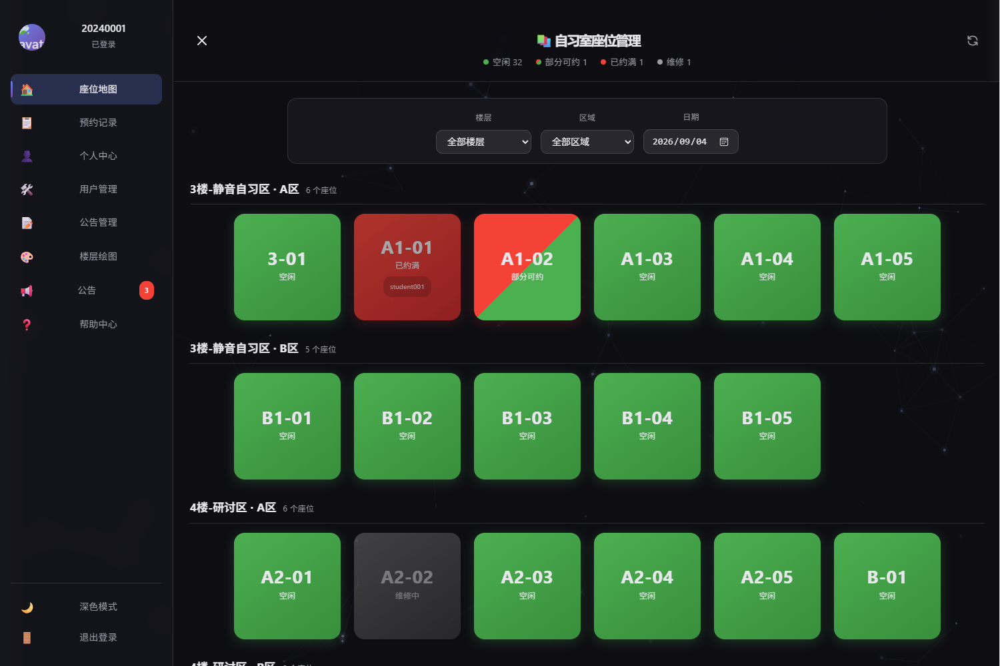
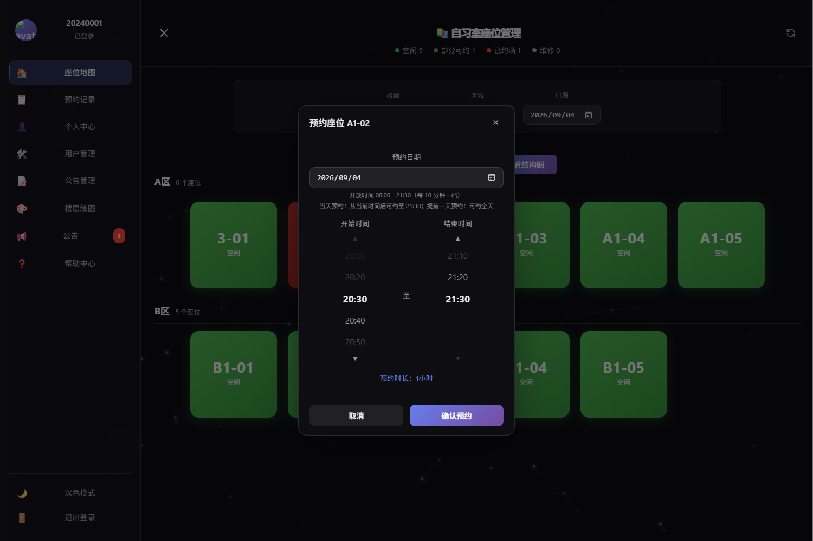
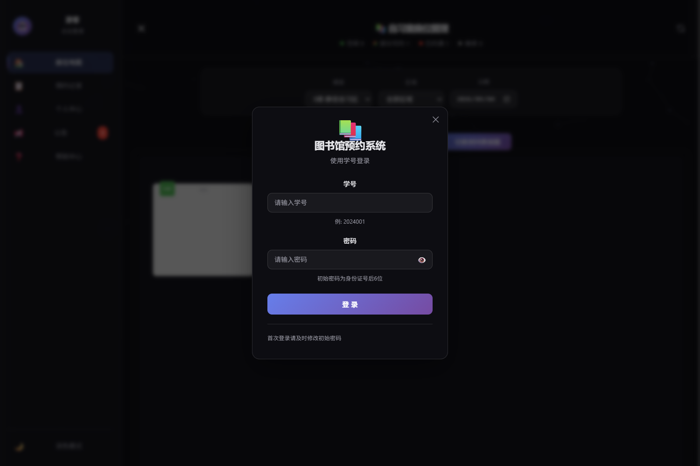
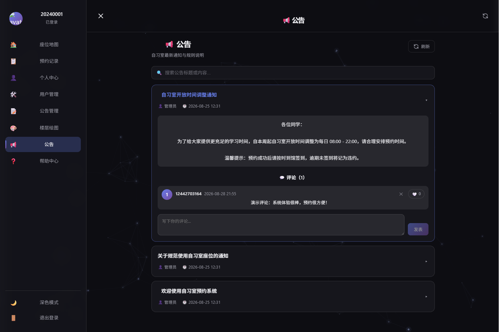
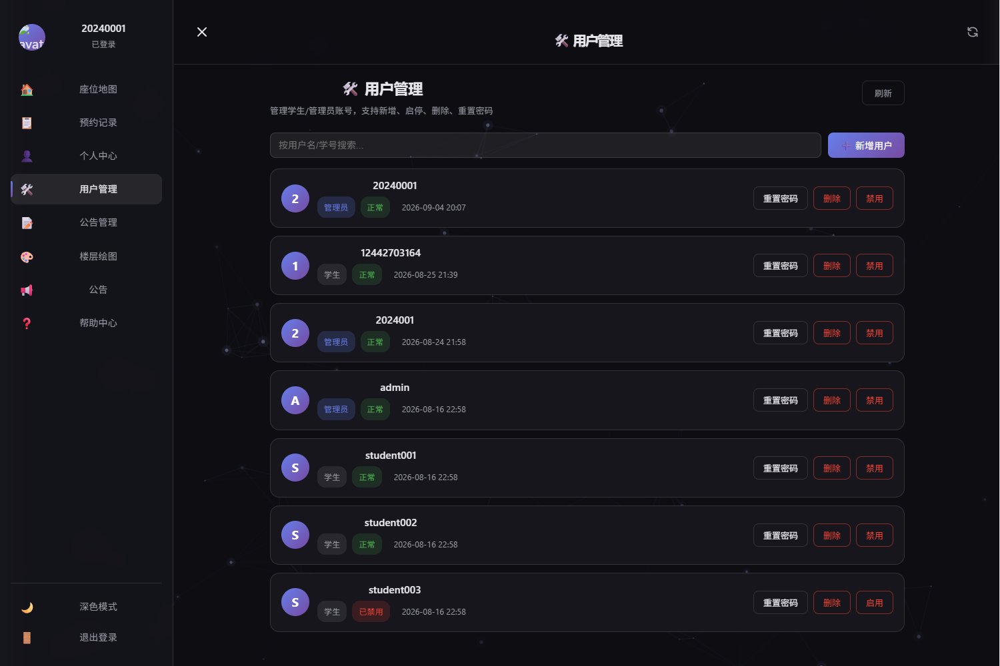
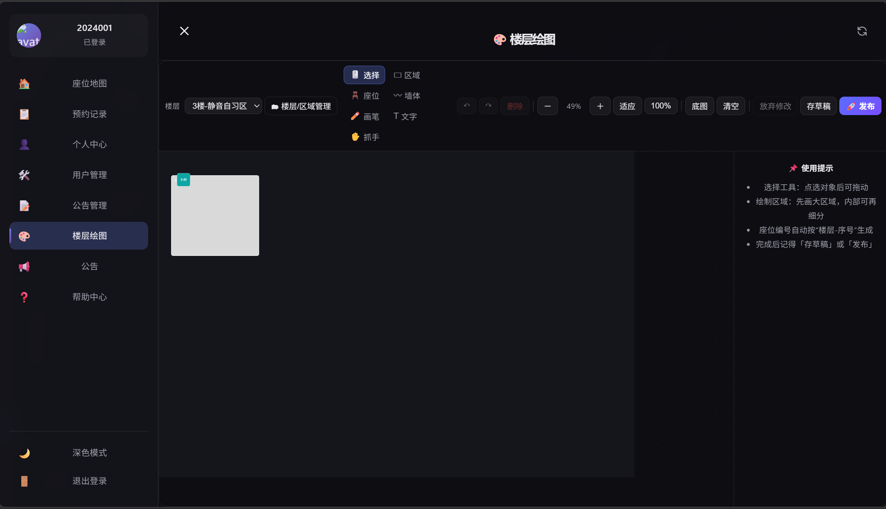

# 📚 自习室座位预约管理系统

> 一个**前后端分离**的自习室座位预约管理系统：学生在线选座预约、签到签退，管理员可视化绘制楼层结构图并统一管理座位、公告与用户。
>
> 技术栈：**Spring Boot 3 + MyBatis-Plus + MySQL + Vue 3 + Vite**
>
> 📖 在线接口文档（GitHub Pages，无需启动后端即可查看全部接口）：[https://2005wang123.github.io/study-room-system/](https://2005wang123.github.io/study-room-system/)

---

## ✨ 效果预览

> 以下截图来自真实运行环境（演示数据）。

| 座位地图（按状态实时着色，支持楼层/区域/日期筛选） | 预约弹窗（自动标记已占用时段） |
| --- | --- |
|  |  |

| 登录 | 公告与评论 | 用户管理（管理员） | 楼层结构图编辑器（管理员） |
| --- | --- | --- | --- |
|  |  |  |  |

---

## 🚀 功能特性

### 👨‍🎓 学生端

- 🔐 注册 / 登录：JWT 认证，BCrypt 密码加密，登录防爆破（失败锁定 + IP 限流）
- 🗺️ 座位地图：按 **楼层 → 区域(房间) → 座位** 三级浏览，支持按楼层 / 区域 / 日期筛选
- 🪑 在线预约：同一座位一天内可分多个时间段预约，支持**冲突时段校验、并发防超卖、单次最长 4 小时、开放时间 08:00–21:30**
- 📅 智能提示：座位颜色实时反映当天可约情况；预约弹窗自动灰显已占用时段，冲突时间不可选
- ✅ 签到 / 签退：预约状态自动流转（待签到 → 使用中 → 已完成），超时未签到记为违约
- 📋 预约记录：查看自己的历史预约与当前状态，可取消未开始的预约
- 📢 公告互动：查看公告、发表评论、删除自己的评论、点赞

### 🛠️ 管理员端

- 👥 用户管理：新增学生/管理员、启用/禁用、重置密码、删除
- 📝 公告管理：新增、编辑、发布 / 下架、删除公告
- 🎨 楼层结构图：可视化绘制工具（区域 / 墙体 / 自由画笔 / 座位 / 文字 / 底图），支持**草稿**与**发布**，发布时自动同步 `seat` 表
- 💺 座位管理：维修中座位置灰不可预约；支持管理员强制取消预约
- 📊 预约管理：全部分页查看所有用户预约记录

### ⚙️ 系统级

- 🔒 Spring Security deny-by-default + JWT 过滤器，接口默认要求登录，公开接口显式放行
- 🎭 角色权限二次校验（`@RequireRole` / `@RequirePermission`）
- ⏱️ 定时任务每小时自动处理：待签到超时 → 违约；使用中超时 → 自动完成并释放座位
- 🛡️ 登录防爆破：同一账号连续失败 5 次锁定 15 分钟；同一 IP 每分钟最多 20 次登录请求

---

## 🧰 技术栈

| 模块 | 技术 |
| --- | --- |
| 后端 | Java 17 · Spring Boot 3.5.5 · Spring Security · MyBatis-Plus 3.5.7 · MySQL · JWT (jjwt 0.11.5) · Caffeine · Knife4j 4.5.0 · Lombok 1.18.46 |
| 前端 | Vue 3 · Vite 8 · Vue Router · Pinia · Axios · Element Plus · Fabric.js 7（楼层结构图绘制） |
| 工具 | Maven · npm · IntelliJ IDEA / VS Code · MySQL 8.x |

---

## 📁 目录结构

```
study-room-system
├── study-room-back/                # Spring Boot 后端
│   ├── src/main/java/com/example/studyroom
│   │   ├── common/                 # 统一响应、全局异常、常量、登录限流
│   │   ├── config/                 # 安全 / 跨域 / 拦截器 / 定时任务 / MyBatis-Plus 配置
│   │   ├── controller/             # 接口层
│   │   ├── dto/                    # 请求 / 响应对象
│   │   ├── entity/                 # 实体类
│   │   ├── mapper/                 # MyBatis-Plus Mapper
│   │   ├── service/                # 业务层
│   │   └── utils/                  # JWT、密码校验等工具
│   └── src/main/resources
│       ├── mapper/                 # MyBatis XML
│       └── sql/                    # 数据库脚本（见下方“初始化数据库”）
├── study-room-front/               # Vue 3 前端
│   ├── src/views/                  # 页面
│   ├── src/components/             # 组件（登录、预约弹窗、楼层绘图等）
│   ├── src/api/                    # 接口封装
│   └── vite.config.js              # 开发服务器与 /api 代理配置
└── docs/screenshots/               # README 效果截图
```

---

## 🧭 快速开始（新手完整版）

> 按顺序操作即可，大约 10 分钟跑通。如果你只装了部分环境，请先看文末 **常见问题**。

### 0️⃣ 环境准备

| 依赖 | 版本要求 | 说明 |
| --- | --- | --- |
| JDK | **17 或 21**（推荐 21） | 后端运行环境；**不要使用 JDK 26**，否则 Lombok 注解不生效，详见文末 FAQ |
| Maven | 3.6+ | 后端依赖管理（IDEA 自带，也可单独安装） |
| MySQL | 8.x | 数据库，本地默认端口 3306 |
| Node.js | 18+（推荐 20/22 LTS） | 前端运行环境（自带 npm） |

> 检查命令：
> ```bash
> java -version    # 应显示 17 / 21
> mvn -version
> node -v && npm -v
> mysql --version
> ```

### 1️⃣ 获取代码

```bash
git clone https://github.com/2005wang123/study-room-system.git
cd study-room-system
```

### 2️⃣ 初始化数据库

1. 启动 MySQL 服务（Windows 可在「服务」中启动，或 `net start mysql`）。
2. 创建数据库并执行脚本。可用 MySQL 命令行，也可用 Navicat / DataGrip 等工具逐条执行。

```bash
mysql -uroot -p
```

```sql
-- 1. 建库（utf8mb4，避免中文乱码）
CREATE DATABASE IF NOT EXISTS study_room_db
  DEFAULT CHARACTER SET utf8mb4 COLLATE utf8mb4_unicode_ci;

USE study_room_db;

-- 2. 建表 + 楼层/区域/座位示例数据（幂等，可重复执行）
SOURCE study-room-back/src/main/resources/sql/schema.sql;

-- 3. 公告表 + 示例公告
SOURCE study-room-back/src/main/resources/sql/announcement.sql;

-- 4. 公告评论表 + 评论点赞表
SOURCE study-room-back/src/main/resources/sql/announcement_comment.sql;

-- 5. 楼层结构图表
SOURCE study-room-back/src/main/resources/sql/floor_layout.sql;
```

> 💡 如果你的数据库是**旧版本升级**（没有 `area` 表），请先执行升级脚本：
> ```sql
> SOURCE study-room-back/src/main/resources/sql/upgrade_area.sql;  -- 幂等，可为 seat 增加 area_id 并初始化区域
> ```

### 3️⃣ 配置数据库连接

默认配置在 `study-room-back/src/main/resources/application.yml`：

```yaml
spring:
  datasource:
    url: jdbc:mysql://localhost:3306/study_room_db?useUnicode=true&characterEncoding=utf-8&serverTimezone=Asia/Shanghai&useSSL=false
    username: root
    password: root
```

如果本机 MySQL 账号密码不是 `root / root`，二选一：

- **方式 A（推荐）**：启动时用环境变量覆盖，无需改代码

  ```bash
  # Windows PowerShell
  $env:DB_USERNAME = "你的账号"
  $env:DB_PASSWORD = "你的密码"
  ```

  ```bash
  # macOS / Linux
  export DB_USERNAME=你的账号
  export DB_PASSWORD=你的密码
  ```

- **方式 B**：直接修改 `application.yml` 中的 `username` / `password`

### 4️⃣ 启动后端

**方式一：IntelliJ IDEA（推荐）**

1. File → Open… 打开项目根目录（Maven 会自动识别 `study-room-back/pom.xml`）
2. 等待右下角依赖下载完成
3. 运行主类 `com.example.studyroom.StudyRoomApplication`
4. 看到 `Started StudyRoomApplication` 即启动成功

**方式二：命令行**

```bash
cd study-room-back
mvn spring-boot:run
```

后端默认端口 **8080**。接口调试 / 在线文档：<http://localhost:8080/doc.html>（Knife4j）。

### 5️⃣ 启动前端

```bash
cd study-room-front
npm install        # 首次需要，安装依赖
npm run dev        # 启动开发服务器
```

浏览器访问 **http://localhost:5137**（开发服务器已将 `/api` 请求代理到后端 8080）。

> 生产构建：`npm run build`，产物输出到 `dist/`。可通过环境变量 `VITE_API_BASE_URL` 指定后端地址（默认 `/api`）。

### 6️⃣ 创建管理员账号

系统**没有内置管理员**。请先注册一个学生账号，再将其提升为管理员：

```sql
USE study_room_db;
UPDATE sys_user SET role = 1 WHERE username = '你的学号';
```

> 也可以在拥有一个管理员后，用后台「用户管理」页面继续创建其他管理员。

### 7️⃣ 访问系统

| 入口 | 地址 |
| --- | --- |
| 前端页面 | http://localhost:5137 |
| 后端接口文档 | http://localhost:8080/doc.html |
| 在线接口文档（GitHub Pages） | https://2005wang123.github.io/study-room-system/ |

---

## ⚙️ 环境变量

| 变量 | 说明 | 默认值 |
| --- | --- | --- |
| `DB_USERNAME` / `DB_PASSWORD` | 数据库账号 / 密码 | `root` / `root` |
| `JWT_SECRET` | JWT 签名密钥（生产环境必改，建议 ≥64 字节） | 内置开发密钥 |
| `JWT_EXPIRATION` | Token 有效期（毫秒） | `86400000`（24 小时） |
| `CORS_ALLOWED_ORIGINS` | 允许跨域的前端来源（逗号分隔） | `http://localhost:5137` |
| `VITE_API_BASE_URL` | 前端请求的后端地址（前端构建时） | `/api` |

---

## 🎨 核心设计说明

### 座位状态颜色（针对所选日期）

| 颜色 | 含义 |
| --- | --- |
| 🟢 绿色 | 当天所有开放时段均空闲，可随时预约 |
| 🔴🟢 半红半绿 | 当天已有部分时段被预约，其余时段仍可约 |
| 🔴 红色 | 当天开放时段（08:00–21:30）已全部约满 |
| ⚪ 灰色 | 维修中，不可预约 |

> 说明：预约成功**不再把座位整体置为“已预约”**，座位颜色由“当天已预约时长占比”实时计算，因此同一座位一天内可被多个用户分时段预约。

### 座位 / 预约状态

- 座位 `seat.status`：`0` 空闲 · `1` 已预约（旧数据兼容）· `2` 使用中 · `3` 维修中
- 预约 `reservation.status`：`0` 待签到 → `1` 使用中 → `2` 已完成；`3` 违约（到期未签到）；`4` 已取消
- 定时任务每小时自动处理：待签到超时 → 违约；使用中超时 → 自动完成并释放座位

### 预约规则

- 开放时间 **08:00 – 21:30**，每 10 分钟一档
- 单次预约最短 10 分钟，最长 4 小时
- 当天预约需至少提前 10 分钟；提前一天可预约全天
- 同一时间段同一座位不可重复预约（冲突校验 + 并发防超卖）
- 同一用户同一时间仅允许一个进行中的预约

### 楼层结构图（管理员绘图）

- 管理员在「楼层绘图」中为每个楼层绘制布局：区域 / 墙体 / 自由画笔 / 座位 / 文字 / 底图
- 绘制结果可保存**草稿**或**发布**；**发布时自动同步座位表**
- 普通用户查看座位地图时，若该楼层已发布结构图，可直接在图上点击座位预约

---

## ❓ 常见问题（FAQ）

### 1. 后端启动报错：端口 8080 已被占用

说明已有进程占用 8080。二选一：

- 找到并结束占用进程：`netstat -ano | findstr :8080`，再 `taskkill /PID <进程号> /F`
- 或修改 `application.yml` 中 `server.port`，同时修改前端 `vite.config.js` 的代理目标

### 2. 编译报错：找不到符号 `setXxx` / `getXxx`（Lombok 不生效）

这是 **JDK 版本不匹配**导致的。JDK 23 及以上默认不再自动运行 classpath 上的注解处理器，因此 Lombok 的 `@Data` 等注解不会生成方法，表现为大量“找不到符号”。

解决办法（任选其一）：

1. **推荐**：使用 JDK 17 或 21（本项目 `pom.xml` 目标版本为 17）。在 IDEA 中：File → Project Structure → Project → SDK 选择 17/21。
2. 若必须使用 JDK 26：请在 `pom.xml` 的 `maven-compiler-plugin` 中显式配置 Lombok 注解处理（`annotationProcessorPaths` + `<proc>full</proc>`），并在 IDEA 中把构建委托给 Maven。

> 项目依赖 Lombok **1.18.46**（官方已支持 JDK 26），问题仅出在“注解处理未显式开启”。

### 3. 启动后端报：数据库连接失败 / Access denied

- 确认 MySQL 服务已启动：`netstat -ano | findstr :3306`
- 确认 `application.yml` 中的账号密码与本地一致，或用环境变量 `DB_USERNAME` / `DB_PASSWORD` 覆盖
- 确认已执行数据库脚本，库名默认为 `study_room_db`

### 4. 前端页面能打开，但接口全部报 401 / 数据加载失败

- 先登录（右上角「点击登录」）
- 确认前端开发服务器代理生效：访问 http://localhost:5137/api/xxx 应能转发到 8080；后端未启动时请先启动后端

### 5. `npm install` 很慢或失败

- 可切换国内镜像：`npm config set registry https://registry.npmmirror.com` 后重试

### 6. 忘记管理员密码怎么办？

直接用 SQL 重置（初始密码规则为身份证号后 6 位，也可在后台「用户管理」中重置）：

```sql
-- 将密码重置为身份证号后 6 位（并标记为首次登录，下次登录会要求改密）
UPDATE sys_user
SET password = '此处填入 BCrypt 加密后的密码', is_first_login = 1
WHERE username = '你的学号';
```

---

## 📄 License

本项目基于 [MIT License](LICENSE) 开源。

版权所有 © 2026 [2005wang123](https://github.com/2005wang123)。保留所有权利。

